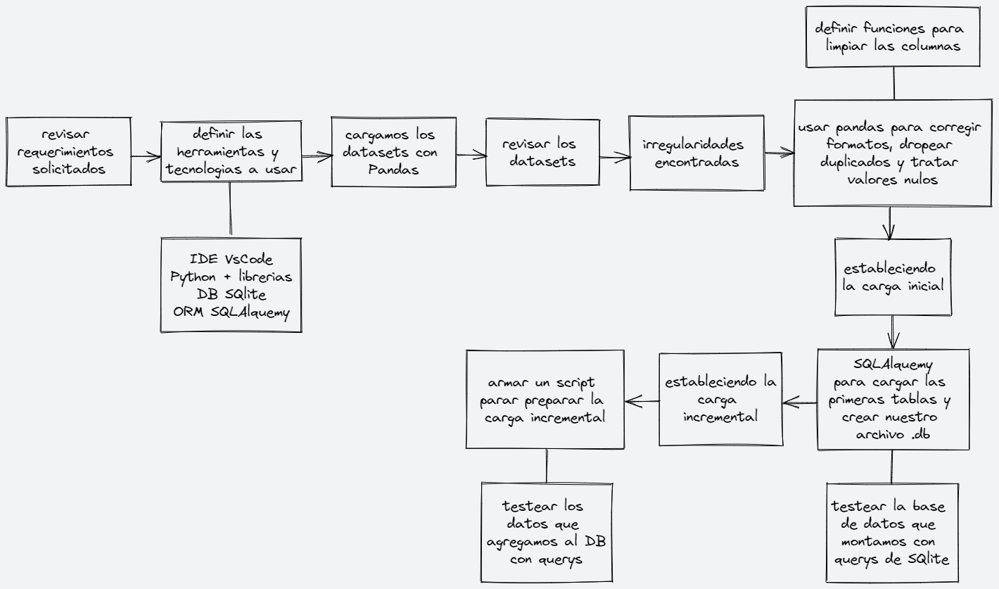

# Proyecto Individual ETL - HENRY
## Data Engineering

Este proyecto tiene como fin establecer un flujo de trabajo para la extraccion, transformacion y carga de varios datasets en distintos formatos hasta conformar una base de datos con toda esta data normalizada 

## Los requerimientos minimos son los siguientes:
- Procesar los diferentes datasets. 
- Crear un archivo DB con el motor de SQL que quieran. Pueden usar SQLAlchemy por ejemplo.
- Realizar en draw.io un diagrama de flujo de trabajo del ETL y explicarlo en vivo.
- Realizar una carga incremental de los archivos que se tienen durante el video.
- Realizar una query en el video, para comprobar el funcionamiento de todo su trabajo. La query a armar es la siguiente: Precio promedio de la sucursal 9-1-688.

## Flujo de trabajo propuesto:

 - Para obtener una base de datos local usaremos SQLite como sistema de gestion de bases de datos, el output de los datasets procesados podran encontrarse ahi
 - El ORM elegido para este proyecto sera SQLAlquemy
 - Se armaran 2 scripts de carga inicial e incremetal, y un archivo que contenga las funciones para limpiar ciertas columnas antes de cargar las tablas a la base de datos
 - Asimismo se haran pruebas de los resultados en la base de datos mediante la ejecucion de querys en SQLite que se podran ver en este [video](https://youtu.be/0mQ6EtkfoIM)

- 